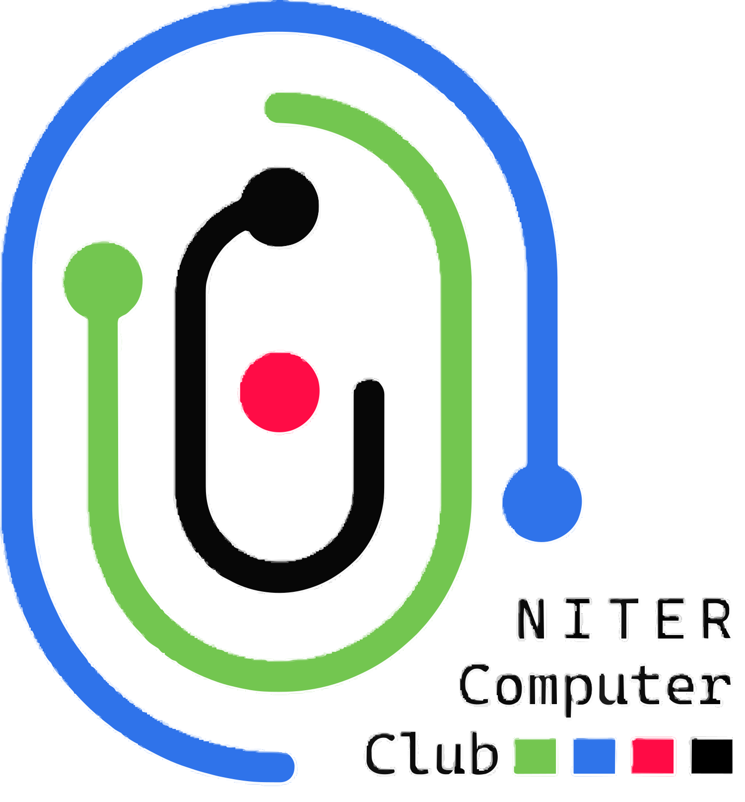

# NITER Computer Club (NCC) - Website MVP



A modern, professional website for the NITER Computer Club built with Next.js 14, TypeScript, and Appwrite backend. Features a comprehensive segment management system with member profiles, achievements, gallery, and events.

## 🌟 Features

### 🏠 **Homepage**
- Modern hero section with club introduction
- Interactive segment cards with hover effects
- Quick navigation to all major sections
- Responsive design for all devices

### 🎯 **Segment Profile System**
- **Individual Segment Pages**: `/segments/[segmentId]` with rich profiles
- **Member Management**: Add, edit, and manage segment-specific members
- **Rich Content**: Vision, mission, activities, achievements
- **Visual Elements**: Header photos, member profile pictures
- **Admin Controls**: Full CRUD operations for segments and members

### 👥 **Member Management**
- **Enhanced Profiles**: Name, role, position, bio, skills, join date
- **Photo Support**: Profile picture uploads and management
- **Segment Assignment**: Members can be assigned to specific segments
- **Skill Tracking**: Tag members with relevant technical skills
- **Contact Information**: Email addresses and professional details

### 🏆 **Achievements**
- **Achievement Gallery**: Showcase club accomplishments
- **Rich Media**: Images, descriptions, dates, categories
- **Admin Management**: Create, edit, delete achievements
- **Professional Display**: Timeline-based achievement showcase

### 📸 **Photo Gallery**
- **Image Management**: Upload and organize club photos
- **Category System**: Organize photos by events, projects, etc.
- **Responsive Grid**: Beautiful photo grid layout
- **Admin Controls**: Full photo management capabilities

### 🎉 **Events**
- **Event Management**: Create and manage club events
- **Rich Details**: Date, location, description, photos
- **Event Status**: Upcoming, ongoing, completed events
- **Visual Timeline**: Professional event display

### 🔐 **Admin Dashboard**
- **Secure Authentication**: Admin-only access to management features
- **Complete CRUD**: Create, read, update, delete all content
- **User-Friendly Interface**: Intuitive admin panels
- **Real-time Updates**: Instant content updates

## 🛠 Technology Stack

### **Frontend**
- **Next.js 14** - React framework with App Router
- **TypeScript** - Type-safe development
- **Tailwind CSS** - Utility-first CSS framework
- **React Hooks** - Modern state management

### **Backend**
- **Appwrite** - Backend-as-a-Service
- **Database** - NoSQL document database
- **Storage** - File upload and management
- **Authentication** - Secure user authentication

### **Development**
- **ESLint** - Code linting
- **PostCSS** - CSS processing
- **File-based Routing** - Next.js routing system

## 🚀 Quick Start

### Prerequisites
- Node.js 18+ 
- npm or yarn
- Appwrite Cloud account

### 1. Clone Repository
```bash
git clone https://github.com/yourusername/ncc-web-mvp.git
cd ncc-web-mvp
npm install
```

### 2. Environment Setup
Create `.env.local` file:
```env
# Appwrite Configuration
NEXT_PUBLIC_APPWRITE_ENDPOINT=https://cloud.appwrite.io/v1
NEXT_PUBLIC_APPWRITE_PROJECT_ID=your-project-id
NEXT_PUBLIC_APPWRITE_DATABASE_ID=ncc-main

# Storage Buckets
NEXT_PUBLIC_APPWRITE_BUCKET_MEMBER_PHOTOS=member-photos
NEXT_PUBLIC_APPWRITE_BUCKET_SEGMENT_PHOTOS=segment-photos
NEXT_PUBLIC_APPWRITE_BUCKET_ACHIEVEMENTS=achievement-images
NEXT_PUBLIC_APPWRITE_BUCKET_GALLERY=gallery-photos
NEXT_PUBLIC_APPWRITE_BUCKET_EVENT_PHOTOS=event-photos

# API Key (Server-side only)
APPWRITE_API_KEY=your-api-key
```

### 3. Appwrite Setup
Follow the complete setup guide: [APPWRITE_SETUP_GUIDE.md](./APPWRITE_SETUP_GUIDE.md)

**Quick Setup Checklist:**
- [ ] Create Appwrite project
- [ ] Create database: `ncc-main`
- [ ] Create collections: `segments`, `members`, `achievements`, `gallery`, `events`
- [ ] Create storage buckets for photos
- [ ] Set proper permissions
- [ ] Add required attributes (see setup guide)

### 4. Run Development Server
```bash
npm run dev
# or
yarn dev
```

Open [http://localhost:3000](http://localhost:3000) in your browser.

### 5. Build for Production
```bash
npm run build
npm start
```
## 📁 Project Structure

```
ncc-web-mvp/
├── app/                          # Next.js 14 App Router
│   ├── (public)/                # Public pages
│   │   ├── about/               # About page
│   │   ├── achievements/        # Achievements gallery
│   │   ├── events/             # Events listing
│   │   ├── gallery/            # Photo gallery
│   │   ├── members/            # Members directory
│   │   └── segments/           # Segment pages
│   │       └── [segmentId]/    # Dynamic segment routes
│   ├── admin/                  # Admin dashboard
│   │   ├── achievements/       # Admin achievements
│   │   ├── dashboard/          # Main admin dashboard
│   │   ├── events/            # Admin events
│   │   ├── gallery/           # Admin gallery
│   │   ├── login/             # Admin authentication
│   │   ├── members/           # Admin members
│   │   └── segments/          # Admin segments
│   ├── globals.css            # Global styles
│   ├── layout.tsx             # Root layout
│   └── page.tsx              # Homepage
├── components/                 # Reusable React components
│   ├── layout/                # Layout components
│   │   ├── Header.tsx         # Navigation header
│   │   └── Footer.tsx         # Site footer
│   ├── segments/              # Segment-specific components
│   │   ├── SegmentEditModal.tsx      # Edit segment modal
│   │   └── SegmentMembersSection.tsx # Member management
│   ├── ui/                    # UI components
│   │   ├── Button.tsx         # Reusable button
│   │   └── PhotoUpload.tsx    # File upload component
│   └── DatabaseDiagnostic.tsx # Database testing utility
├── contexts/                   # React contexts
│   └── AuthContext.tsx        # Authentication context
├── lib/                       # Utility libraries
│   ├── appwrite.ts           # Appwrite client setup
│   └── services.ts           # Database service layer
├── public/                    # Static assets
│   ├── ncc-logo.svg          # Club logo
│   └── site.webmanifest      # PWA manifest
├── APPWRITE_SETUP_GUIDE.md   # Detailed Appwrite setup
├── SEGMENT_PROFILES_GUIDE.md # Segment system guide
└── README.md                 # This file
```

## 🎯 Key Features Explained

### **Segment System**
The segment system allows the club to organize members into different technical areas:

**Segment Profile Features:**
- Rich segment information (vision, mission, activities)
- Header photos and visual branding
- Member showcase with profiles
- Contact information and founding details
- Achievement tracking per segment

**Member Management:**
- Assign members to specific segments
- Rich member profiles with skills and bio
- Profile photo support
- Position and role tracking
- Join date and contact information

### **Admin Dashboard**
Comprehensive admin interface for managing all content:

**Admin Capabilities:**
- Create and manage segments
- Add/edit/remove members
- Upload and manage photos
- Create achievements and events
- Full content management

**Security Features:**
- Authentication required for admin access
- Role-based access control
- Secure API endpoints

## 🔧 Database Schema

### **Segments Collection**
```typescript
type Segment = {
  $id: string
  title: string           // Segment name
  description: string     // Brief description  
  icon?: string          // Emoji or icon
  photoId?: string       // Header image ID
  founded?: string       // Founded date
  activities?: string[]  // Activities (stored as JSON string)
  vision?: string        // Segment vision
  mission?: string       // Segment mission
  achievements?: string[] // Achievements (stored as JSON string)
  contact?: string       // Contact information
}
```

### **Members Collection**
```typescript
type Member = {
  $id: string
  name: string           // Full name
  role: string           // Primary role
  position?: string      // Specific position
  email?: string         // Contact email
  bio?: string          // Biography
  photoId?: string      // Profile photo ID
  order?: number        // Display order
  skills?: string[]     // Skills (stored as JSON string)
  joinDate?: string     // When joined
  segmentId?: string    // Assigned segment
}
```

### **Other Collections**
- **Achievements**: Club accomplishments with photos and details
- **Gallery**: Photo collection with captions and categories
- **Events**: Club events with dates, locations, and descriptions

## 🚀 Deployment

### **Vercel (Recommended)**
1. Connect GitHub repository to Vercel
2. Add environment variables in Vercel dashboard
3. Deploy automatically on git push

### **Other Platforms**
- **Netlify**: Static site deployment
- **Railway**: Full-stack deployment
- **Digital Ocean**: VPS deployment

### **Environment Variables for Production**
Make sure to set all required environment variables in your deployment platform:
- `NEXT_PUBLIC_APPWRITE_ENDPOINT`
- `NEXT_PUBLIC_APPWRITE_PROJECT_ID`
- `NEXT_PUBLIC_APPWRITE_DATABASE_ID`
- All bucket IDs
- `APPWRITE_API_KEY` (server-side only)

## 🎨 Customization

### **Styling**
- Modify `globals.css` for global styles
- Update Tailwind config in `tailwind.config.js`
- Customize colors in CSS variables

### **Content**
- Update club information in layout components
- Modify homepage content in `app/page.tsx`
- Customize navigation in `components/layout/Header.tsx`

### **Features**
- Add new pages in the `app/` directory
- Create new components in `components/`
- Extend database services in `lib/services.ts`

## 🧪 Testing

### **Database Connection**
Use the built-in diagnostic tool:
1. Add `<DatabaseDiagnostic />` to any page
2. Run tests to verify Appwrite connection
3. Check all collections and buckets

### **Manual Testing**
1. Test public pages (segments, achievements, gallery)
2. Test admin authentication and dashboard
3. Test member and segment management
4. Verify photo uploads and display

## 🤝 Contributing

1. Fork the repository
2. Create a feature branch: `git checkout -b feature-name`
3. Make your changes and test thoroughly
4. Commit changes: `git commit -m 'Add feature'`
5. Push to branch: `git push origin feature-name`
6. Submit a pull request

### **Development Guidelines**
- Follow TypeScript best practices
- Use Tailwind for styling
- Write clear, descriptive commit messages
- Test all changes before submitting

## 📚 Documentation

- **Setup Guide**: [APPWRITE_SETUP_GUIDE.md](./APPWRITE_SETUP_GUIDE.md)
- **Segment System**: [SEGMENT_PROFILES_GUIDE.md](./SEGMENT_PROFILES_GUIDE.md)
- **API Documentation**: Check `lib/services.ts` for service methods
- **Component Docs**: Each component has inline documentation

## ⚡ Performance

### **Optimizations**
- Next.js 14 App Router for optimal performance
- Image optimization with Next.js Image component
- Lazy loading for better initial load times
- Efficient database queries with proper indexing

### **Best Practices**
- Use TypeScript for type safety
- Implement proper error handling
- Follow React best practices
- Optimize images before upload

## 🛡 Security

### **Authentication**
- Secure admin authentication with Appwrite
- Protected admin routes
- Session management

### **Data Protection**
- Input validation on all forms
- Secure file upload restrictions
- Proper permission settings in Appwrite

### **Best Practices**
- Environment variables for sensitive data
- API key protection (server-side only)
- Regular security updates

## 🆘 Troubleshooting

### **Common Issues**

**Build Errors**
- Check TypeScript types
- Verify environment variables
- Clear `.next` cache: `rm -rf .next`

**Database Connection Issues**
- Verify Appwrite credentials
- Check collection and bucket IDs
- Ensure proper permissions

**Photo Upload Problems**
- Check bucket permissions
- Verify file size limits
- Confirm file type restrictions

**Development Server Issues**
- Clear node_modules: `rm -rf node_modules && npm install`
- Check port availability
- Verify Next.js version compatibility

### **Getting Help**
- Check the setup guides
- Review Appwrite documentation
- Open an issue on GitHub
- Contact the development team

## 📄 License

This project is licensed under the MIT License - see the LICENSE file for details.

## 🎉 Acknowledgments

- **NITER Computer Club** - For the opportunity to build this platform
- **Next.js Team** - For the amazing React framework
- **Appwrite** - For the excellent backend-as-a-service
- **Tailwind CSS** - For the utility-first CSS framework

## 🔮 Future Enhancements

### **Planned Features**
- **User Registration**: Allow students to register and join segments
- **Project Showcase**: Display club and member projects
- **Event RSVP**: Let members RSVP to events
- **Newsletter**: Email newsletter system
- **Mobile App**: React Native mobile application

### **Technical Improvements**
- **PWA Support**: Progressive Web App features
- **Offline Mode**: Basic offline functionality
- **Analytics**: Usage analytics and insights
- **SEO**: Enhanced search engine optimization
- **Performance**: Advanced caching strategies

## 📞 Contact

**NITER Computer Club**
- **Website**: [Your Website URL]
- **Email**: [Your Email]
- **Location**: National Institute of Textile Engineering & Research

**Development Team**
- **Project Lead**: [Your Name]
- **Repository**: [GitHub Repository URL]
- **Issues**: [GitHub Issues URL]

---

**Built with ❤️ by the NITER Computer Club Development Team**

*Advancing technological excellence through innovative projects and industry partnerships*
4. Note down your **Project ID** and **API Endpoint**

### Step 2: Create API Key

1. In your Appwrite project, go to **Settings > API Keys**
2. Click **Create API Key**
3. Name: `NCC-Web-Admin`
4. Scopes: Select all scopes (for admin operations)
5. Save the **API Key** (you won't see it again)

### Step 3: Create Storage Buckets

Go to **Storage** and create these buckets:

1. **member-photos**
   - Bucket ID: `member-photos`
   - Permissions: 
     - Read: `any`
     - Create/Update/Delete: `users` (admin only)
   - File Size Limit: 5MB
   - Allowed File Extensions: `jpg,jpeg,png,webp`

2. **achievement-images**
   - Bucket ID: `achievement-images`
   - Same permissions and settings as above

3. **gallery-photos**
   - Bucket ID: `gallery-photos`
   - Same permissions and settings as above

### Step 4: Create Database Collections

Go to **Databases** and create a database called `ncc-main`. Then create these collections:

#### Collection 1: `segments`
```json
{
  "collectionId": "segments",
  "attributes": [
    {
      "key": "title",
      "type": "string",
      "size": 255,
      "required": true
    },
    {
      "key": "description",
      "type": "string",
      "size": 1000,
      "required": true
    },
    {
      "key": "icon",
      "type": "string",
      "size": 255,
      "required": false
    }
  ],
  "permissions": {
    "read": ["any"],
    "create": ["users"],
    "update": ["users"],
    "delete": ["users"]
  }
}
```

#### Collection 2: `members`
```json
{
  "collectionId": "members",
  "attributes": [
    {
      "key": "name",
      "type": "string",
      "size": 255,
      "required": true
    },
    {
      "key": "role",
      "type": "string",
      "size": 255,
      "required": true
    },
    {
      "key": "photoId",
      "type": "string",
      "size": 255,
      "required": false
    },
    {
      "key": "email",
      "type": "string",
      "size": 255,
      "required": false
    },
    {
      "key": "bio",
      "type": "string",
      "size": 1000,
      "required": false
    },
    {
      "key": "order",
      "type": "integer",
      "required": false,
      "default": 0
    }
  ],
  "permissions": {
    "read": ["any"],
    "create": ["users"],
    "update": ["users"],
    "delete": ["users"]
  }
}
```

#### Collection 3: `achievements`
```json
{
  "collectionId": "achievements",
  "attributes": [
    {
      "key": "title",
      "type": "string",
      "size": 255,
      "required": true
    },
    {
      "key": "date",
      "type": "datetime",
      "required": true
    },
    {
      "key": "description",
      "type": "string",
      "size": 1000,
      "required": true
    },
    {
      "key": "imageId",
      "type": "string",
      "size": 255,
      "required": false
    }
  ],
  "permissions": {
    "read": ["any"],
    "create": ["users"],
    "update": ["users"],
    "delete": ["users"]
  }
}
```

#### Collection 4: `gallery`
```json
{
  "collectionId": "gallery",
  "attributes": [
    {
      "key": "imageId",
      "type": "string",
      "size": 255,
      "required": true
    },
    {
      "key": "caption",
      "type": "string",
      "size": 500,
      "required": true
    }
  ],
  "permissions": {
    "read": ["any"],
    "create": ["users"],
    "update": ["users"],
    "delete": ["users"]
  }
}
```

### Step 5: Create Admin User

1. Go to **Auth > Users**
2. Click **Create User**
3. Fill in:
   - **Email:** your admin email
   - **Password:** strong password
   - **Name:** Admin User
4. Save the user

### Step 6: Configure Environment Variables

Create `.env.local` file with your Appwrite credentials:

```env
NEXT_PUBLIC_APPWRITE_ENDPOINT=https://cloud.appwrite.io/v1
NEXT_PUBLIC_APPWRITE_PROJECT_ID=your_project_id_here
NEXT_PUBLIC_APPWRITE_DATABASE_ID=ncc-main
NEXT_PUBLIC_APPWRITE_BUCKET_MEMBER_PHOTOS=member-photos
NEXT_PUBLIC_APPWRITE_BUCKET_ACHIEVEMENTS=achievement-images
NEXT_PUBLIC_APPWRITE_BUCKET_GALLERY=gallery-photos
APPWRITE_API_KEY=your_api_key_here
```

### Step 7: Test the Connection

1. Start your dev server: `npm run dev`
2. Go to `/admin/login`
3. Use the admin credentials you created
4. Test CRUD operations in the admin panel

## 🛠️ Development Commands

```powershell
# Install dependencies
npm install

# Run development server
npm run dev

# Build for production
npm run build

# Start production server
npm start

# Run linting
npm run lint
```

## 📁 Project Structure

```
├── app/
│   ├── (public)/          # Public pages
│   │   ├── page.tsx       # Home page
│   │   ├── members/       # Members page
│   │   ├── achievements/  # Achievements page
│   │   └── gallery/       # Gallery page
│   ├── admin/             # Admin panel
│   │   ├── login/         # Admin login
│   │   ├── dashboard/     # Admin dashboard
│   │   └── [management]/  # CRUD pages
│   ├── layout.tsx         # Root layout
│   └── globals.css        # Global styles
├── components/
│   ├── layout/            # Layout components
│   ├── ui/                # Reusable UI components
│   └── [feature]/         # Feature-specific components
├── lib/
│   └── appwrite.ts        # Appwrite client config
└── public/                # Static assets
```

## 🔐 Security Notes

- Never commit `.env.local` to version control
- Use different API keys for development and production
- Regularly rotate your API keys
- Review and adjust Appwrite permissions as needed
- Enable rate limiting in production

## 🚀 Deployment

1. **Deploy to Vercel/Netlify**
2. **Set environment variables** in your hosting platform
3. **Update Appwrite settings:**
   - Add your production domain to Appwrite project settings
   - Update CORS settings if needed
4. **Test all functionality** on production

## 📖 Next Steps

- [ ] Implement authentication flow
- [ ] Add CRUD operations for all collections
- [ ] Set up image upload functionality
- [ ] Add form validation
- [ ] Implement search and filtering
- [ ] Add dark mode
- [ ] Set up analytics

## 🤝 Contributing

1. Fork the repository
2. Create a feature branch
3. Make your changes
4. Test thoroughly
5. Submit a pull request


